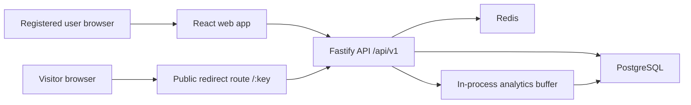

# System Overview

Status: Approved design for Phase 2. Implementation has not started.

## System Context

Reduc.to is a modular monolith API plus a separately deployed React frontend. Registered users manage links and view analytics through the web dashboard. Visitors open public short-link URLs and are redirected by the API. PostgreSQL is the durable system of record. Redis supports redirect caching and rate limiting.

## Actors

- Visitor: opens public short links without an account.
- Registered user: creates and manages owned links and views analytics.
- Web frontend: browser application deployed separately from the API.
- API process: Fastify application to be implemented in later phases.
- PostgreSQL: durable storage for users, links, refresh sessions, refresh tokens, click events, and daily aggregates.
- Redis: cache and rate-limit store.

## Main Components

## External Dependencies

- Static frontend hosting platform, vendor deferred.
- Container-capable API hosting platform, vendor deferred.
- Managed PostgreSQL in production.
- Managed Redis in production.
- No third-party geolocation API during redirects.
- No message queue in the first release.

## Trust Boundaries

- Browser to web app: untrusted user input begins here.
- Browser to API: all request data, headers, cookies, and path parameters are untrusted until validated.
- API to PostgreSQL: trusted internal network boundary, still using parameterized ORM access later.
- API to Redis: trusted infrastructure dependency, but Redis data must be treated as cacheable state that can be stale.
- API logs and analytics: must not contain raw IP addresses, raw tokens, passwords, or unnecessary personal data.

## High-Level Request Flows

### Authenticated API Flow

1. Browser sends request to `/api/v1/...` with HTTP-only auth cookies.
2. API assigns or propagates a request ID.
3. CSRF checks run for unsafe state-changing methods.
4. Access token is verified.
5. Handler validates input.
6. Service enforces ownership and business rules.
7. Repository reads or writes PostgreSQL.
8. Response uses the shared JSON and error conventions.

### Public Redirect Flow

1. Visitor requests `/:key`.
2. API canonicalizes the key to lowercase `lookupKey`.
3. API checks Redis using cache-aside.
4. On cache miss, API reads PostgreSQL.
5. API rejects missing, disabled, expired, or deleted links.
6. API returns HTTP 302 by default, or the link's configured redirect type.
7. API hands a minimized analytics event to the in-process buffer.

## Deployment Shape

The first-release deployment shape is separate frontend and API deployments. Application APIs use `/api/v1`. The public redirect route remains outside `/api` as `/:key`. Operational endpoints use `/health` and `/ready` outside `/api/v1` so load balancers and platform probes do not depend on application versioning.

## Availability Assumptions

- PostgreSQL is required for durable writes and cache misses.
- Redis is optional for correctness but important for latency and rate limiting.
- If Redis is down, redirects fall back to PostgreSQL.
- If analytics buffering fails, valid redirects continue and the failure is logged safely.

## Scalability Direction

The first release remains a modular monolith. Scale direction is vertical scaling and horizontal API replicas behind a load balancer. Redis reduces hot redirect read pressure. PostgreSQL indexes support owner dashboards and redirect lookup. Analytics buffering may later migrate to a durable queue if event durability becomes more important.

## Deliberate Exclusions

- No microservices.
- No Kafka, RabbitMQ, BullMQ, or external queue in the first release.
- No geolocation in the first functional release.
- No anonymous link creation.
- No administrator portal.
- No server-side destination preview fetching in the first release.
