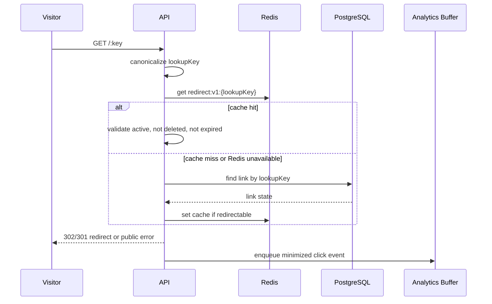

# Redirect and Cache Design

Status: Approved design for Phase 2. Implementation has not started.

## Public Key Namespace Decision

Use one unambiguous shared routing namespace with two stored values:

- `displayKey`: user-facing key shown in URLs and dashboards.
- `lookupKey`: canonical lowercase key used for routing and uniqueness.

Generated keys are 7-character lowercase Base36 values using `0123456789abcdefghijklmnopqrstuvwxyz`. Public route inputs are canonicalized with locale-independent ASCII lowercase. Generated keys and custom aliases share the same canonical `lookupKey` namespace.

In the first release, generated keys and custom aliases normally store the same value in `displayKey` and `lookupKey`. `displayKey` remains as a presentation boundary for future display needs, not for case preservation.

Custom aliases are trimmed, validated, normalized to lowercase, and stored with `displayKey = lookupKey`.

PostgreSQL must enforce unique `lookupKey` across generated codes and aliases, including soft-deleted links. Deleted keys are not reused in the first release.

## Canonicalization

1. Parse public route key as a path segment.
2. Reject empty, too long, malformed, or reserved-route keys.
3. Lowercase using locale-independent ASCII rules.
4. Use the result as `lookupKey`.

## Redirect Resolution Sequence

## Cache-Aside Behavior

Redis is a cache-aside dependency. PostgreSQL remains the source of truth. Cache hits must still check cached `isActive`, `expiresAt`, `deletedAt`, and `redirectType` values before redirecting.

## Redis Key Format

`redirect:v1:{lookupKey}`

The version segment allows future cache-shape changes without key ambiguity.

## Cached Data Shape

Serialized JSON:

- `linkId`
- `userId`
- `displayKey`
- `lookupKey`
- `destinationUrl`
- `redirectType`
- `isActive`
- `expiresAt`
- `deletedAt`
- `cacheWrittenAt`

Do not cache sensitive user fields or analytics details.

## TTL Strategy

Use a bounded TTL for redirectable links. If `expiresAt` is set, the TTL must not extend beyond the expiration time. Exact numeric TTLs are deferred, but the first release should prefer short enough TTLs to limit stale redirects and long enough TTLs to protect hot links.

## Invalidation

Invalidate `redirect:v1:{lookupKey}` after committed changes to destination URL, title if cached, active state, expiration, redirect type, or soft deletion. Alias changes are not allowed in the first release.

## Expiry, Disabled, and Deleted Links

Expired, disabled, and deleted links must not redirect. Do not cache negative responses in the first release. Avoiding negative caching keeps behavior simple when owners re-enable links or create new links.

## Redis Failure Behavior

For redirects, fail open with respect to Redis by querying PostgreSQL. For cache writes and invalidations, log safe context and continue when the database operation already committed. Repeated Redis failures should be observable through logs and metrics.

## Serialization

Use JSON serialization for the first release. Validate parsed cached data before use so corrupt cache entries fall back to PostgreSQL.

## Stale-Data Risks

Stale cache can redirect a disabled or edited link if invalidation fails. Mitigations are post-commit invalidation, bounded TTLs, not caching negative results, and safe logging of invalidation failures.

## Redirect Status

Default redirect status is HTTP 302. Per-link `redirectType` may be `TEMPORARY_302` or `PERMANENT_301` in the data model, with careful user warnings before 301 support is exposed.

## Security Considerations

Reduc.to performs client-side redirects and does not normally fetch destination URLs server-side. This reduces classic SSRF risk for redirects, but does not eliminate abuse risk. Destination validation should reject unsupported schemes, embedded credentials, malformed hostnames, localhost, loopback, private/link-local ranges, and metadata service addresses where detectable from the URL.

URL validation cannot prove a destination is safe or non-phishing. Future server-side preview fetching would require a separate SSRF review.

## Analytics Handoff

After a valid redirect decision, the API hands a minimized event to the analytics buffer. Buffer failure must not unnecessarily block the redirect.

## Performance Goals

Non-binding targets for later implementation:

- Redis cache hit redirect path should avoid PostgreSQL.
- Database miss path should remain simple and indexed by `lookupKey`.
- Analytics enqueue should be non-blocking and bounded.
