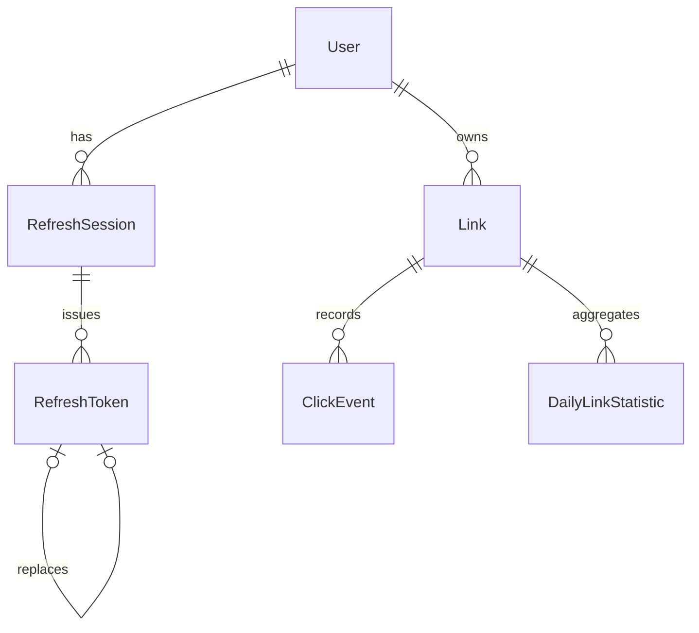

# Data Model

Status: Approved design for Phase 2. Implementation has not started. This is not a Prisma schema.

## ID Strategy

Use UUID v7 for internal primary keys.

Reasoning:

- PostgreSQL can store UUID values efficiently.
- UUID v7 is time-sortable, improving index locality compared with UUID v4.
- IDs are safer to expose than auto-incrementing integers.
- TypeScript and Prisma can represent UUIDs as strings.
- Operational complexity is lower than custom ID formats.

Exact UUID generation location is deferred.

## Relationship Diagram

## User

Purpose: Represents a registered account.

Primary key: `id` UUID v7.

Fields:

- `id`: required UUID v7.
- `email`: required normalized email used for login uniqueness.
- `displayEmail`: optional original or presentation email if approved later.
- `passwordHash`: required sensitive value.
- `displayName`: optional.
- `role`: required, default `USER`.
- `createdAt`: required UTC timestamp.
- `updatedAt`: required UTC timestamp.

Relationships:

- Has many `Link`.
- Has many `RefreshSession`.

Unique constraints:

- Unique normalized `email`.

Check constraints:

- `role` is one of approved role values.
- Email is non-empty after normalization.

Soft deletion: Deferred. Users are retained unless a future account-deletion policy is approved.

Sensitive fields: `passwordHash`.

Retention: Retained indefinitely for the first release.

Email handling:

- Trim leading/trailing whitespace.
- Normalize domain to lowercase.
- Store a canonical lowercase login email for first release.
- Enforce uniqueness on normalized email.
- Avoid login/register responses that reveal whether an account exists more than necessary.

## Link

Purpose: Represents a short link owned by one user.

Primary key: `id` UUID v7.

Fields:

- `id`: required UUID v7.
- `userId`: required owner ID.
- `displayKey`: required user-facing generated code or normalized alias.
- `lookupKey`: required lowercase canonical routing key.
- `destinationUrl`: required validated URL.
- `title`: optional owner-managed metadata.
- `isActive`: required boolean, default true.
- `expiresAt`: optional UTC timestamp.
- `redirectType`: required enum, default `TEMPORARY_302`.
- `createdAt`: required UTC timestamp.
- `updatedAt`: required UTC timestamp.
- `deletedAt`: optional UTC timestamp.

Relationships:

- Belongs to `User`.
- Has many `ClickEvent`.
- Has many `DailyLinkStatistic`.

Unique constraints:

- Unique `lookupKey` across all links, including soft-deleted links.

Check constraints:

- `lookupKey` is lowercase and non-empty.
- `displayKey` is non-empty.
- `redirectType` is `TEMPORARY_302` or `PERMANENT_301`.
- `expiresAt` is null or later than `createdAt`.

Soft deletion:

- Set `deletedAt`.
- Do not reuse `lookupKey` in the first release.
- Deleted links do not redirect.

Destination URL handling:

- Allow `http` and `https` only.
- Reject unsupported schemes, embedded credentials, malformed hostnames, localhost, loopback, private ranges, link-local ranges, and metadata-service addresses where detectable.
- Preserve meaningful components including path, query, and fragment.
- Do not silently rewrite destinations beyond safe parsing and validation.

Retention: Soft-deleted links are retained.

## RefreshSession

Purpose: Represents an authenticated browser session family.

Primary key: `id` UUID v7.

Fields:

- `id`: required UUID v7.
- `userId`: required user ID.
- `familyId`: required UUID v7.
- `expiresAt`: required UTC timestamp.
- `revokedAt`: optional UTC timestamp.
- `revocationReason`: optional safe reason.
- `createdAt`: required UTC timestamp.
- `updatedAt`: required UTC timestamp.

Relationships:

- Belongs to `User`.
- Has many `RefreshToken`.

Unique constraints: None beyond primary key unless implementation chooses to make `familyId` unique.

Check constraints:

- `expiresAt` is later than `createdAt`.
- `revokedAt` is null or later than or equal to `createdAt`.

Soft deletion: Not used; sessions are expired or revoked, then cleaned up after a buffer.

Sensitive fields: None directly, but session records are security-sensitive.

Retention: Retain expired or revoked sessions and token records until expiry plus cleanup buffer.

## RefreshToken

Purpose: Represents one issued refresh token in a session rotation chain.

Primary key: `id` UUID v7.

Fields:

- `id`: required UUID v7.
- `sessionId`: required refresh session ID.
- `tokenHash`: required sensitive hash of the raw refresh token.
- `issuedAt`: required UTC timestamp.
- `expiresAt`: required UTC timestamp.
- `consumedAt`: optional UTC timestamp set during successful rotation.
- `revokedAt`: optional UTC timestamp set when the token is revoked outside normal consumption.
- `replacedByTokenId`: optional self-reference to the successor token.

Relationships:

- Belongs to `RefreshSession`.
- Optionally references the next `RefreshToken` in the rotation chain through `replacedByTokenId`.

Unique constraints:

- Unique `tokenHash`.
- `replacedByTokenId` should not point to more than one predecessor.

Check constraints:

- `expiresAt` is later than `issuedAt`.
- `consumedAt` is null or later than or equal to `issuedAt`.
- `revokedAt` is null or later than or equal to `issuedAt`.

Soft deletion: Not used.

Sensitive fields: `tokenHash`.

Retention: Cleaned up with the owning expired or revoked session after the approved cleanup buffer.

## ClickEvent

Purpose: Raw minimized analytics event for a valid redirect.

Primary key: `id` UUID v7.

Fields:

- `id`: required UUID v7.
- `linkId`: required link ID.
- `occurredAt`: required UTC timestamp.
- `visitorHash`: optional HMAC output for approximate uniqueness.
- `referrerHost`: optional sanitized host.
- `browserFamily`: optional minimized classification.
- `operatingSystemFamily`: optional minimized classification.
- `deviceType`: optional enum such as `desktop`, `mobile`, `tablet`, `bot`, or `unknown`.
- `isBot`: required boolean, default false.
- `source`: optional safe event source metadata.

Relationships:

- Belongs to `Link`.

Unique constraints: None initially.

Check constraints:

- `occurredAt` is non-null.
- `deviceType` is one of approved values when present.

Soft deletion: Not used.

Sensitive fields: `visitorHash` is privacy-sensitive. Raw IP addresses and complete user-agent strings are not stored.

Retention: 90 days.

## DailyLinkStatistic

Purpose: Compact daily aggregate for long-range analytics.

Primary key: `id` UUID v7.

Fields:

- `id`: required UUID v7.
- `linkId`: required link ID.
- `date`: required UTC date bucket.
- `totalClicks`: required integer, default 0.
- `approximateUniqueVisitors`: required integer, default 0.
- `createdAt`: required UTC timestamp.
- `updatedAt`: required UTC timestamp.

Relationships:

- Belongs to `Link`.

Unique constraints:

- Unique `linkId` and `date`.

Check constraints:

- Counts are greater than or equal to zero.

Soft deletion: Not used.

Retention: Retained indefinitely.
